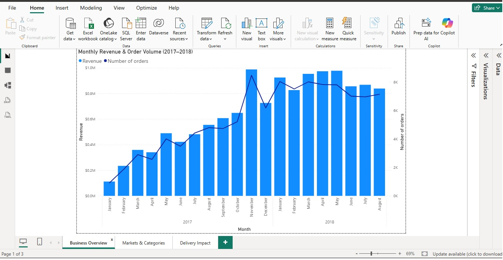
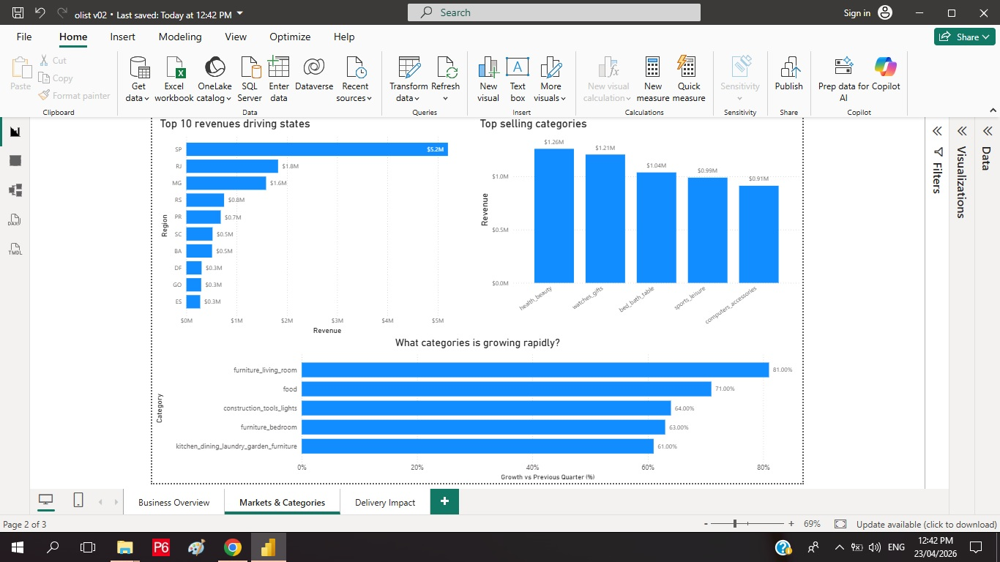
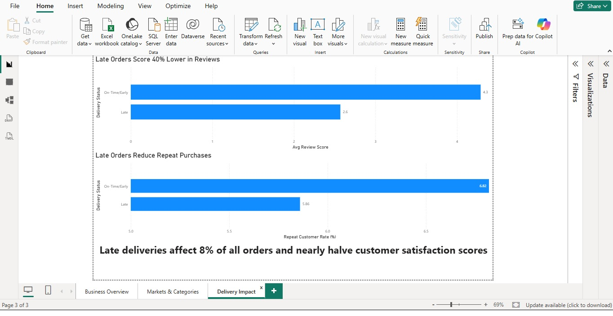

# Olist E-Commerce Analysis

My second data analysis project. I analyzed 100,000+ orders from Olist, Brazil's largest e-commerce marketplace, using PostgreSQL and Power BI.

---

## What I was trying to answer

- How is the business performing overall, and is it growing?
- Which sellers are hurting the platform, and which ones deserve recognition?
- Which product categories are growing fast enough to stock up on?
- Do late deliveries actually affect whether customers come back?

---

## Tools used

- **PostgreSQL** (pgAdmin) — querying and analysis
- **Power BI** — 3-page dashboard
- **SQL** — CTEs, window functions, CASE WHEN, conditional aggregation, date functions

---

## Data cleaning

A few issues I found and fixed before starting the analysis:

- Null values in `product_category_name` were replaced with `'unclassified'` so they wouldn't get dropped during joins
- Orders marked as "delivered" but missing an actual delivery date were excluded — keeping them would have broken the late vs. on-time logic
- Timestamp columns were cast from strings to datetime to allow date comparisons
- The dataset starts in Sep 2016 but Nov 2016 is completely missing, and the first few months had almost no orders (Sep: 4, Oct: 324, Dec: 1). I used `HAVING COUNT > 500` to scope the analysis to Jan 2017 onwards where the data is actually meaningful

---

## Dashboard

### Page 1 — Business Overview
Monthly revenue and order volume from Jan 2017 to Aug 2018. Revenue peaked at ~988K in November 2017.

### Page 2 — Markets & Categories
- São Paulo generates 5.2M in revenue — more than double the next state (RJ at 1.8M)
- Health & Beauty is the top category at 1.26M, followed closely by Watches & Gifts
- Furniture (Living Room) and Food grew 81% and 71% respectively in the last quarter of available data

- 

### Page 3 — Delivery Impact

| | On-Time | Late |
|---|---|---|
| Avg Review Score | 4.29 | 2.57 |
| Repeat Customer Rate | 6.82% | 5.86% |

Late deliveries hit about 7,700 orders (8% of total) and drop the average review score by 40%.

---

## Key findings

- Revenue grew roughly 8x from Jan 2017 to its peak in Nov 2017, then leveled off into 2018
- SP dominates revenue but that concentration is a risk — if that market slows, it shows up everywhere
- Furniture and food categories are worth watching for inventory planning based on the growth trend
- Some sellers with high order volumes have average scores below 3.0 and 1-star rates worth flagging
- Late delivery has a measurable impact on satisfaction — the 4.29 vs 2.57 gap is hard to ignore

---

## SQL files

| File | What it covers |
|---|---|
| `1_general_insights.sql` | Monthly revenue, top states, top categories |
| `2_seller_analysis.sql` | Top sellers, worst sellers, bad experience rate by category |
| `3_product_trends.sql` | Fastest growing categories (QoQ) |
| `4_delivery_impact.sql` | Late delivery vs review score and repeat purchase rate |

---

## Dataset

[Olist Brazilian E-Commerce Dataset](https://www.kaggle.com/datasets/olistbr/brazilian-ecommerce) — available on Kaggle. Covers 100K+ orders from 2016–2018 across multiple Brazilian states.
